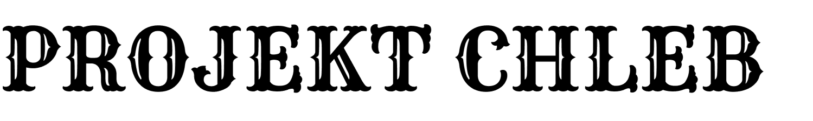

Website for the "Projekt Chleb" initiative, developed with a tech stack:

- [React](https://reactjs.org)
- [NextJS](https://nextjs.org)
- [Typescript](https://www.typescriptlang.org/)
- Linting with [ESLint](https://eslint.org/)
- Formatting with [Prettier](https://prettier.io/)
- Linting, typechecking and formatting on by default using [`husky`](https://github.com/typicode/husky) for commit hooks
- Testing with [Jest](https://jestjs.io/) and [`react-testing-library`](https://testing-library.com/docs/react-testing-library/intro)

## 🌍 Website

[Projekt Chleb deployed on Vercel](https://projekt-chleb-website.vercel.app)

## 💻 How to use

Execute below command to run project in dev mode:

```bash
yarn dev
```

## 🎨 Design documentation

See [/docs/Readme.md](/docs/Readme.md).
